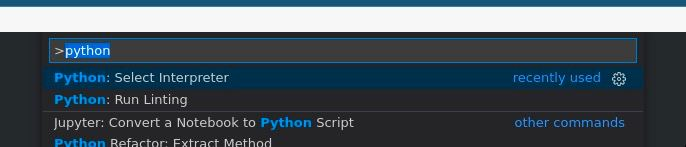
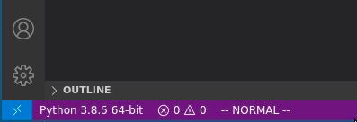
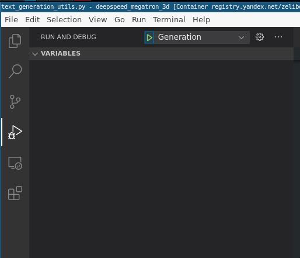
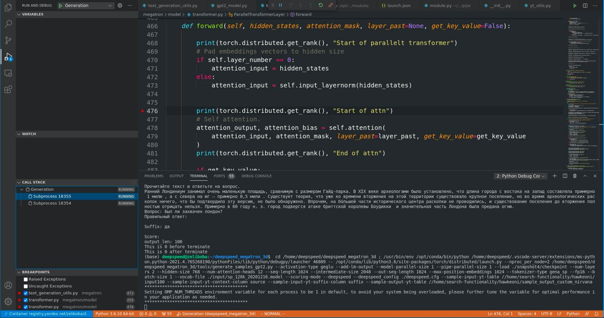

# VSCode

## Extensions

* [Markdown](https://marketplace.visualstudio.com/items?itemName=DavidAnson.vscode-markdownlint)

Then press Ctrl+Shift+P and write "Markdown". You need to find "Open Preview". Enjoy.

* [Jupyter](https://marketplace.visualstudio.com/items?itemName=ms-toolsai.jupyter)
* [Python](https://marketplace.visualstudio.com/items?itemName=ms-python.python)
* [Remote SSH](https://marketplace.visualstudio.com/items?itemName=ms-vscode-remote.remote-ssh)
* [Remote-Containers](https://marketplace.visualstudio.com/items?itemName=ms-vscode-remote.remote-containers)
* [Vim](https://marketplace.visualstudio.com/items?itemName=vscodevim.vim) (Осторожно, сразу включится режим как в виме!)
* [C/C++](https://marketplace.visualstudio.com/items?itemName=ms-vscode.cpptools)

## Python settings

Остро стоит вопрос выбора IDE. Проблема в том, что мы часто разрабатываем удаленно, а зачастую удаленно + внутри докера. Соответственно хочется, чтобы был выполнен ряд требований:

1. Была возможность править код в remote (так будет называться удаленная машина) и не заниматься ручной синхронизацией.
2. Была возможность автодополнения и прочих радостей по типу инспекции кода. Причем делать это хочется не через дублирование окружающей среды, а по-честному, чтобы прям сорцы библиотек можно было править (так вообще говоря делать не стоит, но вставить print можно).
3. Была возможность дебага прямо из редактора/IDE, чтобы не ломать глаза об pdb.

Уверен, что искушенный читатель сможет сделать такое внутри своего любимого редактора. Я вот перешел с pycharm и могу отметить следующие плюсы:

1. VSCode очень быстрый и модульный. Выражается это хотя бы в том, что при переключении интерпретатора (например между виртуальными средами) Pycharm начинает переиндексировывать весь код + библиотеки, что может занять минут 15, в течении которых компьютер будет гудеть, а редактор откажется делать автодополнения и инспекцию. VSCode же переключает среду моментально, однако сразу после переключения автодополнение и инспекция работают с небольшой задержкой.
2. VSCode при удаленной разработке запускается удаленно, а свой интерфейс прокидывает на главный хост. Таким образом файлы не синхронизируются между машинами, а находятся и правятся сразу на remote. Pycharm же честно каждый раз внутри себя запускает что-то типа rsync. У меня он очень часто что-то забывал копировать.

### Autocomplite

Первым делом идем в extensions, ставим плагин [Python](https://marketplace.visualstudio.com/items?itemName=ms-python.python) от Microsoft. После этого вызываем command palette ctrl + shift + p и идем в settings.json (preferences settings...).

Вставляем в json такую запись:

     "python.languageServer": "Jedi",

Эта строка отвечает за дефолтный language server (он же LSP), он будет заниматься всем анализом кода.

Снова нажимаем ctrl + shift + p, находим "Python: select interpreter", выбираем нужный интерпретатор. Альтернативно слева снизу будет уже какой-то интерпретатор, можно будет на него кликнуть.

Поздравляю, теперь у нас есть автодополнение и анализ кода. Можно, например порадоваться, написать import torch и перейти в сорцы торча.

**N.B. Далее подобный трюк мы будем проворачивать и в докере, и на удаленном сервере. Чтобы это заработало там, нужно повторить процедуру, в том числе и поставить плагин внутри контейнера или сервера. Делается это абсолютно так же, как и тут.**

## Подключение к удаленному серверу (докеру) и настройка анализа кода

Ситуация такая - есть удаленный сервер, там есть код, хочется его править. Или ситуация еще хуже, на удаленном серевере есть докер, там есть код и хочется там его править. Сейчас научимся с таким работать.

Вначале рассмотрим ситуацию, где есть удаленный сервер. Первым делом ставим расширение [Remote SSH](https://marketplace.visualstudio.com/items?itemName=ms-vscode-remote.remote-ssh) от Microsoft. После этого уже знакомым движением вызывает command palette и выбираем Remote-SSH: connect to host. Дале все интуитивно. Отдельно отмечу, что VSCode автоматически берет конфигурации из /.ssh/config. Теперь открыт новый VSCode, который работает удаленно. В него нужно заново поставить Python-плагин (все так же), снова выбрать нужный интерпретатор и вуаля - все готово. По взаимодействию такой VSCode ничем не отличается от обычного, кроме того, что он работает и правит код на другой машине.
Докер работает аналогичным способом. Ставим расширение от Microsoft [Remote-Containers](https://marketplace.visualstudio.com/items?itemName=ms-vscode-remote.remote-containers). В command palette выбираем опцию _Remote-Containers: attach to running container_, далее коннектикмся по имени контейнера. Снова в контейнере ставим плагин Python, снова выбираем нужный питон (например в дефолтном контейнере deepspeed нужен питон который из /opt/conda....).

Что делать, если докер работает на удаленном сервере, например на zeliboba? Все просто. Вначале первым способом подключатесь к зелибобе по SSH через Vscode, потом в этом VSCode подключаетесь к докеру. Все настолько просто.

**Совет про Remote SSH плагин**: Если вы используете Remote SSH плагин, то из-за слишком большого количества файлов могут возникнуть проблема с тем, что VSCode не успевает индексировать все изменения (или вообще не может следить за изменением файлов). Чтобы этого избежать, нужно добавить в remote settings  из Command palette как можно больше папок, которые не нужно индексировать, например те, которые вы не собираетесь менять:

     {
          {
          "files.watcherExclude": {
               "folder1/**": true,
               "folder2/**": true,
               ...etc
          }
     }

### Debugging

Предполагается, что читатель уже находится в нужном месте (на сервере, в докере, на сервере в докере, у себя на машине....). Более того, предполагается, что и интерпретатор питона уже настроен. Хочется запустить какой-либо скрпит и продебагать его.

Все очень просто, переходим в левой панели на вкладку debug, щелкаем на шестеренку в выпавшем меню и начинаем править конфигурации для дебага.

Как найти дебаг меню и шестеренку: на картинке верхний левый угол VSCode. Вкладка debug 4я в левой колнке, шестеренка справа сверху.

Осталось написать конфигурацию. Вот пример одной из моих конфигураций (а если точнее, это файл, где можно кучу конфигураций написать, но она у меня там одна).

[Конфигурация для дебага](./conf.json)

Что значат разные ключи оттуда и что они делают можно прочитать [здесь](https://code.visualstudio.com/docs/python/debugging). Я же опишу только те ключи, которые использовал сам, они вполне себе составят хороший набор для начала.

* name - название конфигурации, чтобы было понятно, какую мы сейчас запускаем в меню дебага
* type - python (не знаю, что это, менять не надо)
* request - тип дебага. launch запускает скрипт, есть еще attach, он позволяет к уже готовому процессу, запущенному через python -m debugpy  подключиться по порту. Подробнее можно прочитать в статье выше.
* program - какой код запускать
* justMyCode - флаг, по умолчанию True. Означает, что брейкпоинты будут работать только в нашем коде. Нужно поставить в False, если хочется ставить брейкпоинты прямо в библиотеках.
* args - в общем-то аргументы питоновского скрипта. Нужно писать, как в примере, все отдельным элементом списка.
* pythonArgs - аргументы именно интерпретатора питона.
* env - словарь переменных окружения, например можно передавать видимые видеокарты, как в примере.
* cwd - рабочая директория.

Дальше дело за малым. Слева от номера строки ставим брейкпоинты (красные точки). Брейкпоинты можно сделать условными. Далее запускаем дебаг и все почти как в пайчарме.

Отдельной проблемой стоит дебаг multiprocess скриптов. Однако немного темной магии и даже это заработает. Данная конфигурация протестирована в рамках скриптов вида _python -m torch.distributed.launch_ , но скорее всего с минимальными изменениями заработает в сценарии запуска через deepspeed. Про mpirun ничего не могу сказать.

[Пример конфига для python -m torch.distributed.launch](./conf_torch_distributed.json)

Какие ключевые изменения - в поле "program" теперь не сам скрипт, а скрипт, который мы изначально вызываем в питоне. Его опции и путь уже к нужному скрипту (generate_samples_gpt2.py) переехал в аргументы. Как видно из картинки, слева снизу в дебагере vscode появляются фреймы, соответствующие форкнутым процессам. Между ними можно легко переключаться и дебагать как обычно.

Пример дебага с несколькими процессами:

