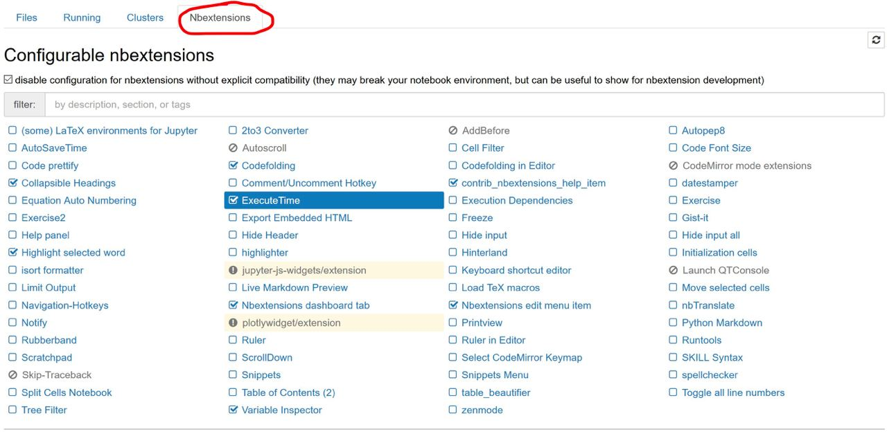

# Jupyter notebook

1. to install

        pip3 install jupyterlab

2. Useful settings

        pip3 install jupyter_contrib_nbextensions
        pip3 install jupyter_nbextensions_configurator
        jupyter nbextensions_configurator enable
        jupyter contrib nbextensions install 

After installation, you need to restart Jupyter.
If everything ok, then the 4th Nbextensions tab will appear in the Jupyter Notebook.

In this tab, you can enable and disable various extensions. If extensions are not displayed, you need to uncheck the box in the upper left corner. The following basic extensions are recommended:

- Collapsible headings
- Highlight selected word
- Codefolding
- ExecuteTime
- Variable Inspector
- Hinterland (autocomplit without tab)
- Select CodeMirror Keymap (give oppotunity to choosing vim or emax key-map)
